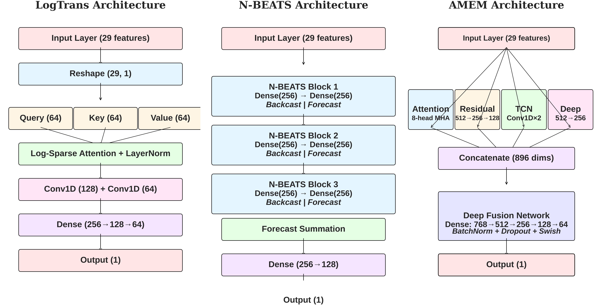
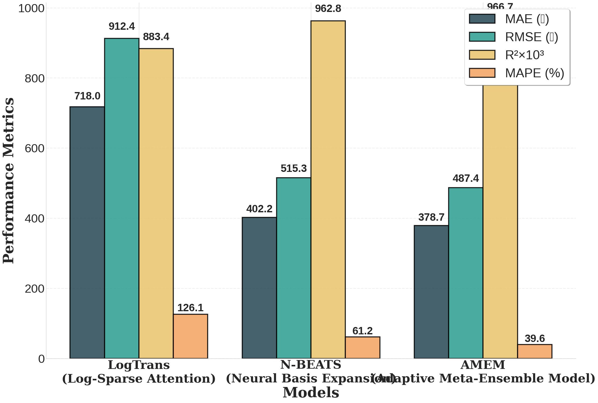
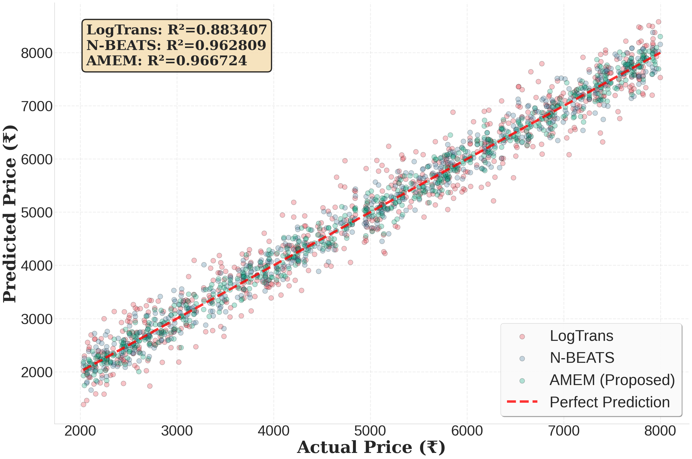
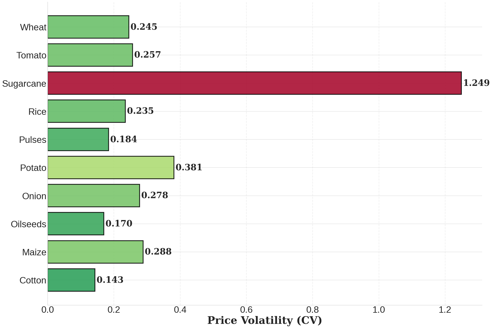
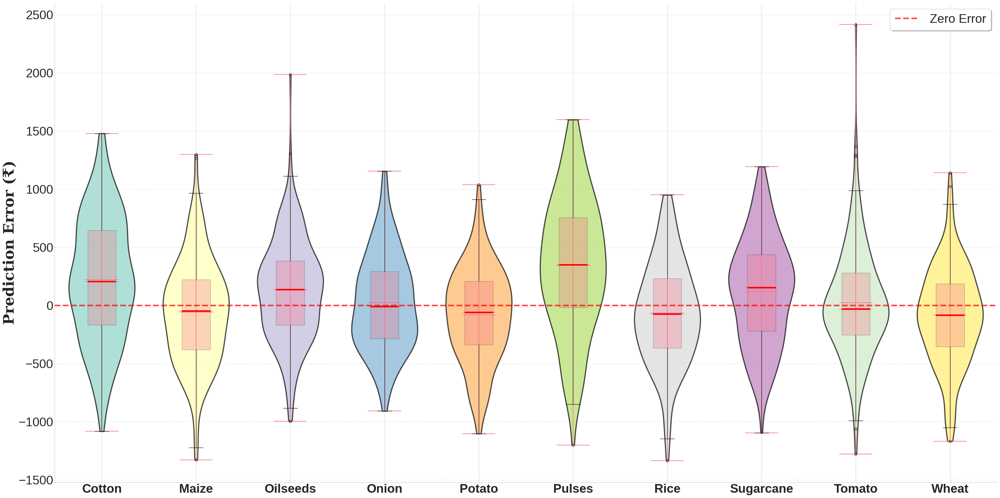
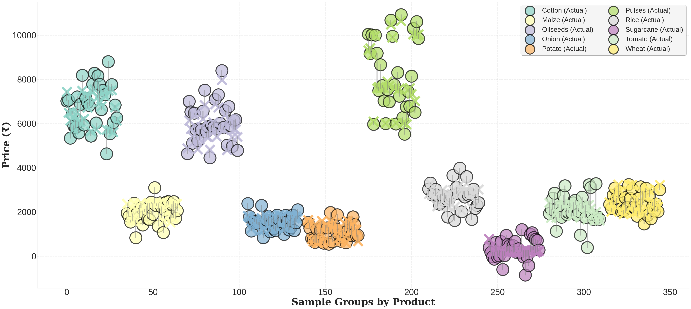
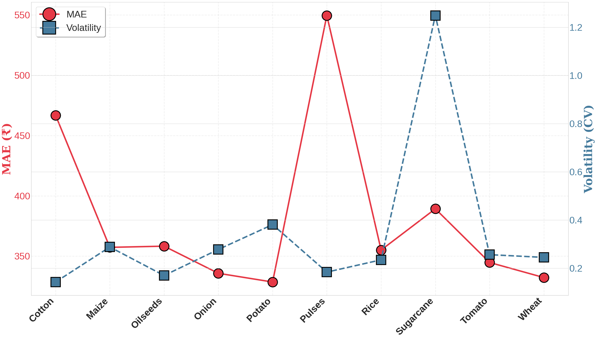
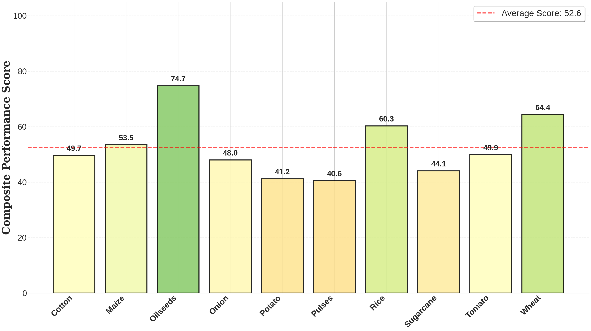

# Adaptive Meta-Ensemble Model for Agricultural Price Prediction

[](https://colab.research.google.com/drive/1koRlL96yTTucs0Y9mjm1N65nqVfCm7id?usp=sharing)

## Overview

This repository contains the implementation of the **Adaptive Meta-Ensemble Model (AMEM)** - a novel deep learning architecture for agricultural commodity price forecasting in Indian markets. AMEM integrates multiple specialized neural networks to achieve superior prediction accuracy compared to state-of-the-art models.

### Key Highlights

- **Multi-Branch Architecture**: Combines dual multi-head attention, triple residual blocks, and temporal convolutional networks
- **Adaptive Meta-Learning**: Dynamic weighting mechanism that adjusts branch contributions based on input characteristics
- **Comprehensive Dataset**: 8,400 observations spanning 2010-2023 across 10 major crops and multiple Indian states
- **Superior Performance**: R² of 0.967, MAE of 378.74, MAPE of 39.62%

## Architecture Comparison



*Comparison of LogTrans, N-BEATS, and proposed AMEM architectures*

## Results

### Performance Metrics

| Model | MAE | RMSE | R² | MAPE |
|-------|-----|------|-----|------|
| LogTrans | 717.99 | 912.44 | 0.883 | 126.14% |
| N-BEATS | 402.21 | 515.33 | 0.963 | 61.24% |
| **AMEM (Proposed)** | **378.74** | **487.45** | **0.967** | **39.62%** |



*Comparative analysis of model performance metrics*

### Prediction Accuracy



*Scatter plot showing predicted versus actual prices across all models*

### Error Analysis


*Residual distribution analysis and feature importance scores*

### Crop-Specific Analysis



*Price volatility across different crops measured by coefficient of variation*



*Distribution of prediction errors for each crop category*

### Price Clustering



*Natural groupings of crops based on actual price ranges*

### Volatility vs Prediction Difficulty



*Relationship between price volatility and prediction error (correlation = 0.67)*

### Composite Performance



*Overall performance scores across different crop categories*

## Key Improvements

- **47.3% improvement** over LogTrans in MAE
- **5.8% improvement** over N-BEATS in MAE
- **Statistically significant** improvements (p < 0.001)

## Dataset

### Data Sources
- Reserve Bank of India (Macroeconomic indicators, crop statistics, MSP data)
- World Bank Group Climate Knowledge Portal (Rainfall data)
- World Bank Open Data (Population statistics)
- Food and Agriculture Organization (Global Food Price Index)
- Multi Commodity Exchange of India (Wholesale prices)

### Coverage
- **Temporal**: 2010-2023 (Annual granularity)
- **Spatial**: Major producing states (Haryana, Punjab, UP, Maharashtra, Karnataka, Andhra Pradesh)
- **Crops**: Cotton, Maize, Oilseeds, Onion, Potato, Pulses, Rice, Sugarcane, Tomato, Wheat

### Features (29 engineered)
- Temporal patterns (year, lags, growth rates)
- Macroeconomic indicators (GDP, CPI, WPI, exchange rates)
- Production statistics (area, yield, output)
- Policy variables (Minimum Support Price)
- Climatic factors (rainfall patterns)
- Interaction terms (GDP-CPI, exchange rate-WPI)
- Volatility measures

## Model Architecture

### AMEM Components

1. **Dual Multi-Head Attention Branch**
   - First layer: 8 heads with 64-dimensional projections
   - Second layer: 4 heads with 128-dimensional projections
   - Captures fine-grained and abstract feature relationships

2. **Triple Residual Network Branch**
   - Three residual blocks (512 → 256 → 128 units)
   - Swish activation with batch normalization
   - Enables deep nonlinear transformations

3. **Temporal Convolutional Network Branch**
   - Causal dilated convolutions (dilation rates: 1, 2, 4)
   - Filters: 64 → 128 → 64
   - Captures long-range temporal dependencies

4. **Deep Fusion Network**
   - Four dense layers (768 → 512 → 256 → 128)
   - Integrates information from all branches

5. **Meta-Learning Framework**
   - Adaptive weights computed via softmax
   - Dynamic adjustment based on input characteristics

## Training Configuration

- **Optimizer**: AdamW (lr=0.001, weight_decay=0.01)
- **Loss Function**: Huber Loss (δ=1.0)
- **Batch Size**: 64
- **Epochs**: 200 (with early stopping)
- **Split**: 80% training / 20% testing
- **Regularization**: Dropout (0.2-0.3), Batch Normalization

## Installation
```bash
